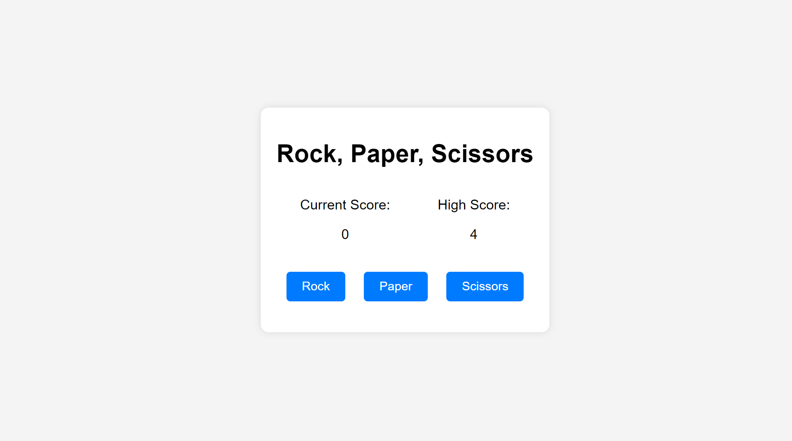

# Rock, Paper, Scissors Game

This simple web-based Rock, Paper, Scissors game was created using HTML, CSS, and JavaScript.

## How to Play

1. Open the game in a web browser.

2. Click on one of the three options: Rock, Paper, or Scissors.

3. The computer will also make a random choice.

4. The result of the round (win, lose, or tie) will be displayed on the screen.

5. Also you can see your win streak!

6. Keep playing to see if you can beat the computer!

## Features


- User-friendly interface.
- Fun and interactive gameplay.
- Random computer choices for a fair game.

## Technologies Used

- HTML
- CSS
- JavaScript

## Demo

You can play the game live here: [Demo Link](https://sanskargupta0.github.io/Rock_Paper_Scissors/)

## Screenshots



## Getting Started

To run this project locally, follow these steps:

1. Clone the repository:

```bash
https://github.com/Sanskargupta0/Rock_Paper_Scissors.git
